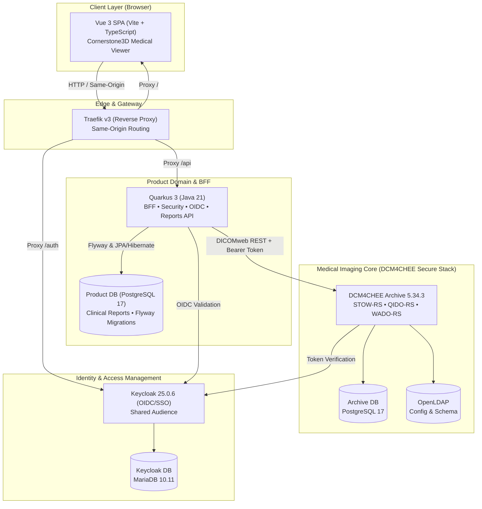

# BlackICE: Modern Healthcare DICOM & PACS Platform

<div align="center">

| Backend & BFF | Frontend & Viewer | PACS & Identity | Standards & Quality |
| :---: | :---: | :---: | :---: |
| [](https://adoptium.net/) | [](https://vuejs.org/) | [](https://www.dcm4che.org/) | [](https://www.dicomstandard.org/) |
| [](https://quarkus.io/) | [](https://www.cornerstonejs.org/) | [](https://www.keycloak.org/) | [](https://datatracker.ietf.org/doc/html/rfc9457) |
| [](https://www.postgresql.org/) | [](https://www.typescriptlang.org/) | [](https://traefik.io/) | [](https://playwright.dev/) |

</div>

<p align="center">
  Language / Idioma: <b>🇺🇸 English</b> | <a href="README.pt-BR.md">🇧🇷 Português</a>
</p>

BlackICE is a modern Healthcare PACS (*Picture Archiving and Communication System*) platform engineered with architectural rigor and full adherence to open healthcare standards (**DICOM PS3**, **DICOMweb**, **OIDC**, and **RFC 9457 Problem Details**).

The platform enforces strict separation of concerns: **DCM4CHEE Archive 5.x** handles core DICOM object storage and DIMSE/DICOMweb networking protocols; **Quarkus 3 (Java 21)** operates as a Backend-For-Frontend (BFF) and hosts the product domain (business metadata, clinical diagnostic reports, and optimistic concurrency) on a dedicated **PostgreSQL 17** database; and **Vue 3 + TypeScript** delivers a high-fidelity clinical user interface featuring an interactive medical viewport powered by **Cornerstone3D**.

> [!NOTE]
> **Origin of the Name**: In the *Cyberpunk 2077* universe, **ICE** stands for ***Intrusion Countermeasures Electronics*** (active defense software designed to safeguard confidential data and protect secure networks). The name **BlackICE** reflects the platform's defensive posture and architectural discipline: strictly isolating the core DICOM engine from direct public browser access, enforcing the BFF security pattern with `HttpOnly` session cookies, leveraging Keycloak OIDC authentication, securing state-changing endpoints with CSRF protection, and guaranteeing clinical patient data integrity.

---

## 🏛️ Architecture and Topology



### Architectural & Security Principles

- **BFF & Same-Origin Pattern**: The browser communicates exclusively with the same origin via Traefik. Client authentication uses secure `HttpOnly` session cookies; no OIDC access tokens are exposed or stored in client-side JavaScript.
- **Shared Audience (SSO)**: A single Keycloak realm (`blackice`) centralizes identity. The BFF client (`blackice-quarkus`) uses an audience mapper to authorize DICOMweb requests against the Archive (`dcm4chee-arc-rs`) while preserving an authentic per-user audit trail.
- **Data Segregation**: Raw DICOM pixel files and instances reside solely in DCM4CHEE storage. The product database (`product-db`) exclusively manages business domain entities (clinical reports, draft/final states, and optimistic concurrency versioning).
- **RFC 9457 Problem Details Contract**: All REST APIs emit uniform `application/problem+json` errors from a centralized catalog, featuring W3C `traceparent` propagation and `X-Trace-ID` headers on every response.
- **CSRF Protection**: All state-changing endpoints enforce signed CSRF tokens backed by HMAC cryptographic signatures.

---

## ⚡ Platform Capabilities

| Module / Flow | Standard / Protocol | Description |
| :-- | :-- | :-- |
| **DICOM Ingestion** | STOW-RS / C-STORE | In-browser manual upload with client-side `.dcm` metadata pre-validation, progress tracking, and authenticated STOW-RS dispatch. Clinical modalities in production send C-STORE DIMSE directly to the Archive. |
| **Clinical Worklist** | QIDO-RS | Searchable study worklist with combinable filters (*Patient Name*, *Patient ID with Issuer*, *Modality*, *Date Range*), count-free lookahead pagination, and adaptive responsive UI (data table on desktop / summary cards on mobile). |
| **Medical Viewer** | WADO-RS & Cornerstone3D | Frame rendering through a secure proxy endpoint, interactive clinical tools (*Window/Level*, *Zoom*, *Pan*, *Reset*, series switching), mobile Capability Gate, and canvas viewport isolation. |
| **Clinical Reports** | REST / JPA / Flyway | End-to-end report creation with `ETag` / `If-Match` optimistic concurrency control, Archive existence pre-validation via QIDO-RS, 32k character limit, lifecycle state transitions (`DRAFT` / `FINAL`), accessible modal dialogue, and relational persistence. |

---

## 📁 Monorepo Structure

```
.
├── apps/
│   ├── backend/               # Quarkus 3 (Java 21) BFF and Product Domain API
│   └── frontend/              # Vue 3 + Vite + TypeScript SPA (Cornerstone3D Viewer)
├── infra/                     # Docker Compose topology orchestration
│   ├── dcm4chee/              # Secured DCM4CHEE Archive 5.x stack (LDAP, MariaDB, Keycloak, Arc-DB, Arc)
│   ├── keycloak/              # Idempotent provisioning scripts and custom theme
│   └── traefik/               # Same-origin reverse proxy configuration
├── docs/                      # Architectural knowledge base and canonical Domain Packs
│   ├── architecture/          # Topology, DCM4CHEE baseline, structure, and evolution backlog
│   ├── contracts/             # RFC 9457 Problem Details catalog and generated schemas
│   ├── domains/               # Portable Domain Packs (DICOM, Vue, Quarkus, Git, Problem Catalog)
│   └── superpowers/           # Historical formal design specs and plans
├── .agents/                   # Agents and skills for Antigravity and Codex
├── .claude/ & .codex/         # Agent wrappers for Claude Code and OpenAI Codex
└── graphify-out/              # Repository semantic and structural knowledge graph
```

Refer to the [canonical project structure guide](docs/architecture/project-structure.md) before moving or creating application modules.

---

## 🚀 Getting Started

### Prerequisites

- **Git**;
- [**mise-en-place**](https://mise.jdx.dev/) (toolchain manager for Java 21, Maven, Node 24, and pnpm);
- **Docker** with **Docker Compose v2**.

### 1. Starting the Complete Local Stack

Configure the environment file and launch all containerized services:

```powershell
# Copy the example environment variables
cp infra/.env.example infra/.env

# Spin up the full topology (Archive, Keycloak, Databases, Traefik, Backend, and Frontend)
cd infra
docker compose -f compose.yml -f dcm4chee/compose.yml -f compose.apps.yml up -d --build
```

Provision the Keycloak realm, OIDC clients, audience mappers, and test users:

```bash
# Via Bash
bash infra/keycloak/configure-blackice.sh

# Or via native PowerShell
pwsh -File infra/keycloak/configure-blackice.ps1
```

The application is available at `http://blackice.localhost/` with pre-configured test credentials:
- **Author / Radiologist**: `dr.teste` / `teste123`
- **Reader / Second Actor**: `dr.leitor` / `teste123`

---

## 🧪 Verification and Testing

### Backend (Quarkus)

The backend features an automated test suite with JUnit 5, REST-assured, and architectural rules verified with **ArchUnit**:

```powershell
cd apps/backend
mise install
mise exec -- mvn test
mise exec -- mvn package
```

Refer to the [backend guide](apps/backend/README.md) for local development workflows and configuration property references.

### Frontend (Vue 3)

The frontend includes unit tests with Vitest and an end-to-end (E2E) test suite with **Playwright** covering all clinical workflows with synthetic DICOM fixtures:

```powershell
cd apps/frontend
mise install
mise exec -- pnpm install --frozen-lockfile
mise exec -- pnpm test
mise exec -- pnpm build
```

#### Running the Full E2E Suite in Playwright:

```powershell
mise exec -- pnpm test:e2e:keycloak   # OIDC authentication and login theme
mise exec -- pnpm test:e2e:ingest     # STOW-RS manual ingestion
mise exec -- pnpm test:e2e:worklist   # QIDO-RS query and combined filters
mise exec -- pnpm test:e2e:viewer     # Cornerstone3D medical viewport
mise exec -- pnpm test:e2e:reports    # Clinical reports and ETag concurrency
```

Refer to the [frontend guide](apps/frontend/README.md) for viewport matrix details and Playwright Docker setup.

### Problem Details Catalog RFC 9457 Verification

```powershell
cd .problem-catalog
mise exec -- pnpm check
```

---

## 📚 Technical Documentation

- [**Canonical Project Structure**](docs/architecture/project-structure.md): Operational rules and recipes for adding new features.
- [**DCM4CHEE Archive Baseline**](docs/architecture/dcm4chee-archive.md): Specifications for archive services, listeners, and storage.
- [**Domain Packs**](docs/domains/README.md): Canonical knowledge base for DICOM semantics, Vue 3, Quarkus, and problem catalogs.
- [**Evolution Backlog**](docs/architecture/evolution-backlog.md): Governed registry of architectural decisions and scalability items.
- [**Graphify Guide**](docs/architecture/graphify.md): Codebase knowledge graph querying and maintenance.

---

## 🔒 Healthcare Compliance & Synthetic Patient Data

All automated tests, fixtures, datasets, and documentation in this repository use **programmatically generated synthetic data**. No real patient information or protected health information (PHI) is ever handled or committed to the repository.
