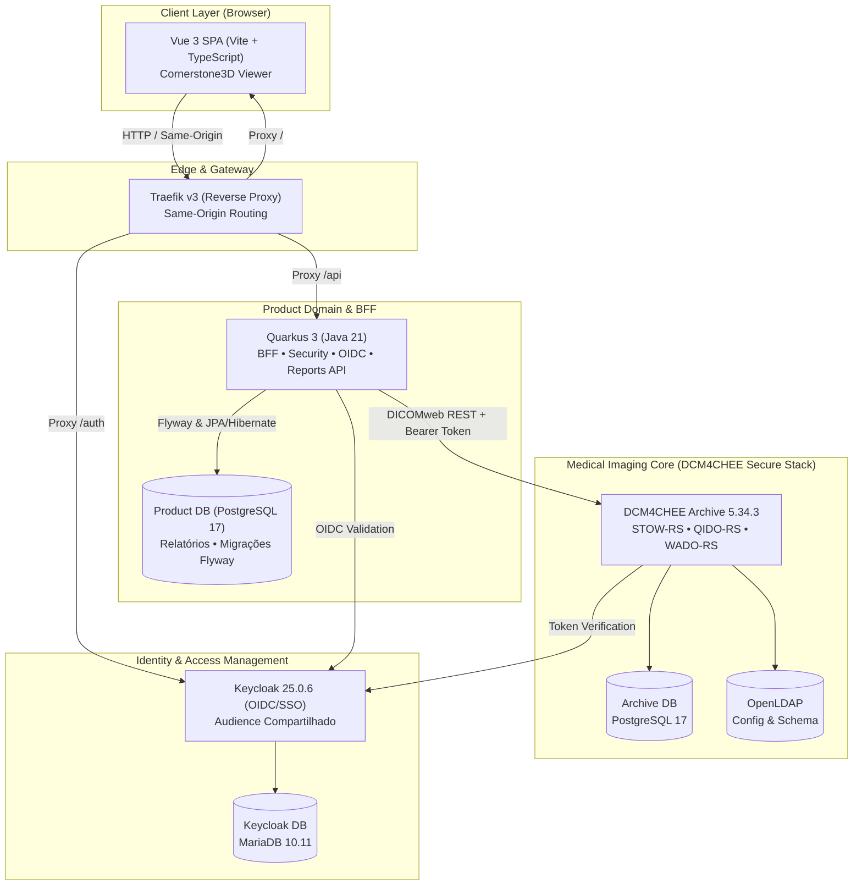

# BlackICE: Modern Healthcare DICOM & PACS Platform

<div align="center">

| Backend & BFF | Frontend & Viewer | PACS & Identidade | Padrões & Qualidade |
| :---: | :---: | :---: | :---: |
| [](https://adoptium.net/) | [](https://vuejs.org/) | [](https://www.dcm4che.org/) | [](https://www.dicomstandard.org/) |
| [](https://quarkus.io/) | [](https://www.cornerstonejs.org/) | [](https://www.keycloak.org/) | [](https://datatracker.ietf.org/doc/html/rfc9457) |
| [](https://www.postgresql.org/) | [](https://www.typescriptlang.org/) | [](https://traefik.io/) | [](https://playwright.dev/) |

</div>

<p align="center">
  Language / Idioma: <a href="README.md">🇺🇸 English</a> | <b>🇧🇷 Português</b>
</p>

BlackICE é uma plataforma PACS (*Picture Archiving and Communication System*) moderna, projetada com rigor arquitetural e aderência aos padrões da indústria médica (**DICOM PS3**, **DICOMweb**, **OIDC** e **RFC 9457 Problem Details**).

A plataforma adota separação estrita de responsabilidades: o motor **DCM4CHEE Archive 5.x** gerencia o armazenamento de objetos DICOM e os protocolos de rede DIMSE/DICOMweb; o **Quarkus (Java 21)** atua como Backend-For-Frontend (BFF) e hospeda o domínio de produto (metadados de negócio, laudos clínicos e controle de concorrência) em **PostgreSQL 17** dedicado; e o **Vue 3 + TypeScript** entrega uma interface clínica de alta fidelidade com visualizador médico baseado em **Cornerstone3D**.

> [!NOTE]
> **Origem do Nome**: No universo de *Cyberpunk 2077*, **ICE** é o acrônimo de ***Intrusion Countermeasures Electronics*** (sistemas de contramedidas e defesa ativa para proteção de dados sensíveis e segurança de rede). O nome **BlackICE** sintetiza a postura defensiva e a disciplina arquitetural da plataforma: isolamento estrito do motor DICOM do acesso público, padrão BFF com cookies seguros `HttpOnly`, autenticação robusta via Keycloak OIDC, proteção CSRF e garantia de integridade e não corrupção de dados clínicos de pacientes.

---

## 🏛️ Arquitetura e Topologia



### Princípios Arquiteturais e de Segurança

- **Padrão BFF & Same-Origin**: O navegador comunica-se exclusivamente com a mesma origem via Traefik. A autenticação com o frontend utiliza cookies `HttpOnly` seguros; nenhum *access token* OIDC é exposto ou persistido no JavaScript do cliente.
- **Audience Compartilhado (SSO)**: Um único realm Keycloak (`blackice`) centraliza a identidade. O client BFF (`blackice-quarkus`) utiliza um mapper de audience para autorizar chamadas DICOMweb contra o Archive (`dcm4chee-arc-rs`) mantendo a trilha de auditoria por usuário real.
- **Segregação de Dados**: Dados DICOM brutos e imagens residem unicamente no storage do DCM4CHEE. O banco de dados do produto (`product-db`) armazena exclusivamente entidades de negócio (laudos clínicos, estados de rascunho/finalizado e controle de concorrência).
- **Contrato de Erro RFC 9457**: Todas as APIs REST emitem `application/problem+json` padronizados, com catálogo centralizado de problemas, rastreabilidade W3C `traceparent` e injeção do header `X-Trace-ID` em todas as respostas.
- **Proteção CSRF**: Endpoints com efeitos colaterais utilizam validação de token CSRF assinado com chave criptográfica HMAC.

---

## ⚡ Capacidades da Plataforma

| Módulo / Fluxo | Padrão / Protocolo | Descrição |
| :-- | :-- | :-- |
| **Importação DICOM** | STOW-RS / C-STORE | Upload manual no navegador com validação local de arquivos `.dcm`, barra de progresso determinada e envio autenticado via STOW-RS. Modalidades clínicas em rede transmitem C-STORE diretamente ao Archive. |
| **Worklist Clínica** | QIDO-RS | Busca textual e estruturada de estudos com filtros combináveis (*Nome do Paciente*, *ID do Paciente com Issuer*, *Modalidade*, *Intervalo de Datas*), paginação adaptativa e layout responsivo (tabela em desktop / cards em mobile). |
| **Visualizador Médico** | WADO-RS & Cornerstone3D | Renderização de frames DICOM via proxy seguro, ferramentas interativas (*Window/Level*, *Zoom*, *Pan*, *Reset*), Capability Gate em dispositivos móveis e isolamento geométrico de viewport. |
| **Laudos Clínicos** | REST / JPA / Flyway | Criação e edição de laudos médicos com controle de concorrência otimista via `ETag` / `If-Match`, validação de existência de estudo no Archive via QIDO-RS, limite de payload de 32k caracteres, ciclo de vida (`DRAFT` / `FINAL`), modal de finalização acessível e persistência relacional. |

---

## 📁 Estrutura do Monorepo

```
.
├── apps/
│   ├── backend/               # API e BFF em Quarkus 3 (Java 21)
│   └── frontend/              # SPA em Vue 3 + Vite + TypeScript (Cornerstone3D)
├── infra/                     # Orquestração Docker Compose da topologia completa
│   ├── dcm4chee/              # Stack DCM4CHEE Archive 5.x seguro (LDAP, MariaDB, Keycloak, Arc-DB, Arc)
│   ├── keycloak/              # Scripts idempotentes de provisionamento e tema de login personalizado
│   └── traefik/               # Configuração do reverse proxy same-origin
├── docs/                      # Conhecimento arquitetural e Domain Packs canônicos
│   ├── architecture/          # Topologia, DCM4CHEE baseline, estrutura e backlog de evolução
│   ├── contracts/             # Catálogo de problemas RFC 9457 e schemas gerados
│   ├── domains/               # Domain Packs agnósticos (DICOM, Vue, Quarkus, Git, Problem Catalog)
│   └── superpowers/           # Histórico e specs formais das decisões de design
├── .agents/                   # Agentes e skills para Antigravity e Codex
├── .claude/ & .codex/         # Wrappers de agentes para Claude Code e OpenAI Codex
└── graphify-out/              # Grafo de conhecimento semântico e relacional do repositório
```

Consulte a [estrutura canônica do projeto](docs/architecture/project-structure.md) antes de criar ou movimentar módulos de código.

---

## 🚀 Como Executar

### Pré-requisitos

- **Git**;
- [**mise-en-place**](https://mise.jdx.dev/) (gerenciador de toolchain para Java 21, Maven, Node 24 e pnpm);
- **Docker** e **Docker Compose v2**.

### 1. Inicializando a Stack Completa

Configure o arquivo de ambiente e inicialize todos os serviços:

```powershell
# Copiar as variáveis de exemplo
cp infra/.env.example infra/.env

# Subir toda a topologia em containers (Archive, Keycloak, Bancos, Traefik, Backend e Frontend)
cd infra
docker compose -f compose.yml -f dcm4chee/compose.yml -f compose.apps.yml up -d --build
```

Provisione a configuração do realm Keycloak, clients OIDC e usuários clínicos de teste:

```bash
# Via Bash
bash infra/keycloak/configure-blackice.sh

# Ou via PowerShell nativo
pwsh -File infra/keycloak/configure-blackice.ps1
```

A aplicação estará disponível em `http://blackice.localhost/` com as seguintes credenciais padrão de teste:
- **Autor / Radiologista**: `dr.teste` / `teste123`
- **Leitor / Segundo Ator**: `dr.leitor` / `teste123`

---

## 🧪 Verificação e Testes

### Backend (Quarkus)

O backend possui suíte de testes automatizados com JUnit 5, REST-assured e regras arquiteturais com **ArchUnit**:

```powershell
cd apps/backend
mise install
mise exec -- mvn test
mise exec -- mvn package
```

Consulte o [guia detalhado do backend](apps/backend/README.md) para desenvolvimento local e documentação de propriedades.

### Frontend (Vue 3)

O frontend possui testes unitários com Vitest e suíte ponta a ponta (E2E) com **Playwright** cobrindo todos os fluxos através de fixtures DICOM sintéticas:

```powershell
cd apps/frontend
mise install
mise exec -- pnpm install --frozen-lockfile
mise exec -- pnpm test
mise exec -- pnpm build
```

#### Executando a Suíte E2E Completa no Playwright:

```powershell
mise exec -- pnpm test:e2e:keycloak   # Autenticação OIDC e tema de login
mise exec -- pnpm test:e2e:ingest     # Importação manual STOW-RS
mise exec -- pnpm test:e2e:worklist   # Consulta QIDO-RS e filtros combinados
mise exec -- pnpm test:e2e:viewer     # Visualizador médico e Cornerstone3D
mise exec -- pnpm test:e2e:reports    # Módulo de laudos clínicos e concorrência ETag
```

Consulte o [guia detalhado do frontend](apps/frontend/README.md) para a matriz de viewports e configurações do Playwright.

### Verificação do Catálogo de Problemas RFC 9457

```powershell
cd .problem-catalog
mise exec -- pnpm check
```

---

## 📚 Documentação Técnica

- [**Estrutura Canônica do Projeto**](docs/architecture/project-structure.md): Diretrizes operacionais para adição de novas features.
- [**Baseline do DCM4CHEE Archive**](docs/architecture/dcm4chee-archive.md): Especificação dos serviços DICOM, listeners e persistência do archive.
- [**Domain Packs**](docs/domains/README.md): Conhecimento canônico de semântica DICOM, Vue 3, Quarkus e catálogo de problemas.
- [**Backlog de Evolução**](docs/architecture/evolution-backlog.md): Registro governado de decisões arquiteturais futuras e itens de escala.
- [**Guia do Graphify**](docs/architecture/graphify.md): Exploração e manutenção do grafo de conhecimento do código.

---

## 🔒 Conformidade e Dados de Pacientes

Todos os testes automatizados, fixtures e documentações deste repositório utilizam **dados sintéticos gerados programaticamente**. Nenhuma informação real de paciente ou exame clínico de produção é manipulada ou versionada no projeto.
